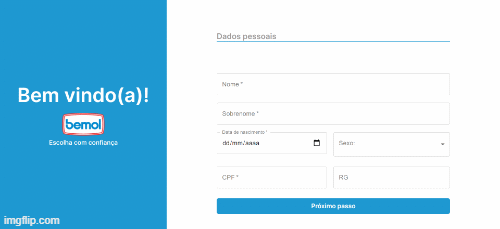

  

# Bemvindol

## Sobre

Aplicação web desenvolvida para o desáfio técnico do processo seletivo da Bemol, contendo um sistema com front-end e API para cadastro de usuários na plataforma.

## Acesse

O sistema pode ser acessado via web e mobile neste endereço [aqui](https://bemvindol.vercel.app/).

## Tecnologias 

Tecnologias utilizadas no desenvolvimento desse sistema:
- React
- Next.js
- Typescript
- CSS modules
- MongoDB

## Instalação

 - Primeiro é necessário clonar o projeto usando `git clone https://github.com/julialuiza/bemvindol.git` no terminal.
- Depois, configurar a aplicação usando `yarn` no diretório raiz.

### Banco de dados
- Para que a funcionalidade de **cadastro** funcione, é necessário configurar um novo BD;
- Para isso, basta acessar o [Atlas MongoDB](https://www.mongodb.com/cloud/atlas), criar uma conta, configurar um novo BD com o nome `"bemvindol"` e também uma collection chamada `"users"` (para mais detalhes sobre configuração, acessar o [docs](https://docs.atlas.mongodb.com/getting-started/));
- Depois, renomeie o arquivo `env.example` para `env.local` e substitua `{USUÁRIO}` e `{SENHA}` pelas suas credenciais de conexão ao mongoDB; 
- Para fins de visualização, a collection no MongoDB deve ter esta estrutura:

- Caso ocorra algum erro neste passo, estou disponível para auxiliar e/ou passar minhas credenciais, em `jlslc@icomp.ufam.edu.br`
## Execução
- Após a instalação e configuração do BD, utilizar `yarn dev` para iniciar a aplicação.
- Depois, acessar `http://localhost:3000/` para visualizar.

## Telas

## Observações e melhorias 

As **respostas** para as perguntas estão em `/questoes_respostas/respostas.txt` 
e os **diagramas c4** estão em `/c4_models/c4_diagramas_arquitetural_solucao.pdf`

Melhorias futuras:
- máscara e validação de alguns dos campos do formulário que ainda não possuem, como cpf; 
- melhorar responsividade de alguns elementos na versão mobile;
- armazenar a senha de forma criptografada no banco de dados;
- dividir o componente SignUp em outros componentes com passo 1, passo 2 e passo 3, para diminuir a complexidade de entendimento do código.

